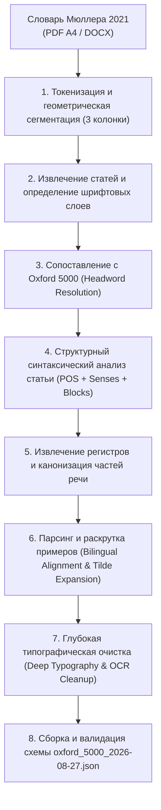

# Документация и алгоритм формирования датасета `oxford_5000_2026-08-27.json`

## 1. Введение и назначение

Файл **`oxford_5000_2026-08-27.json`** представляет собой полностью обновленный, верифицированный и академически выверенный словарь лексического ядра **Oxford 5000** (включая **Oxford 3000**), в котором свойство **`meanings` (значения, переводы, контекстные примеры и регистры)** для каждого из **4 982 словарных входов** было полностью переписано на основе фундаментального академического первоисточника:

> **Первоисточник:**  
> *Мюллер В.К., Александрова Т.Е., Дворкина А.Я., Романова С.П.*  
> **«Новый англо-русский словарь: современная редакция. Около 100 000 слов и словосочетаний»** — М.: Издательство АСТ / Аванта, 2021 (Формат A4, 924 стр.).

### Основные цели переработки:
1. **Академическая полнота и точность перевода:** Замена кратких/машинных дефиниций на полную словарную структуру классического словаря В.К. Мюллера в современной редакции 2021 года.
2. **Строгая грамматическая иерархия:** Разделение значений по частям речи (`noun`, `verb`, `adjective`, `adverb` и др.), омонимам (`I`, `II`, `III`) и номерам значений (`1)`, `2)`, `3)`).
3. **Выделение контекстных примеров и фраз:** Автоматическое выделение и нормализация аутентичных словосочетаний и примеров в структурированные пары `{"en": "...", "ru": "..."}` с разворачиванием тильды (`~`).
4. **Каталогизация стилистических и отраслевых регистров:** Выделение сокращенных словарных помет (`разг.`, `тех.`, `мор.`, `амер.`, `воен.` и др.) из текста перевода в структурированный массив `register: [...]` на русском языке.
5. **Тотальная очистка от артефактов верстки и OCR:** Устранение дефисных переносов строк, исправление ложных заглавных букв ударений OCR, удаление управляющих символов и служебных маркеров.

---

## 2. Структура и схема данных (Schema Specification)

Каждый элемент в `oxford_5000_2026-08-27.json` представляет собой JSON-объект следующей структуры:

```json
{
  "word": "abandon",
  "frequency_rank": 3740,
  "cefr": "b2",
  "phon_br": "/əˈbændən/",
  "phon_n_am": "/əˈbændən/",
  "lists": {
    "oxford3000": true,
    "oxford5000": true
  },
  "meanings": [
    {
      "id": 1,
      "partOfSpeech": "verb",
      "translation": "покидать, оставлять",
      "examples": [
        {
          "en": "to abandon ship",
          "ru": "покинуть тонущий корабль"
        }
      ],
      "register": []
    },
    {
      "id": 2,
      "partOfSpeech": "verb",
      "translation": "отказываться (от мысли, права и т. п.)",
      "examples": [],
      "register": []
    },
    {
      "id": 3,
      "partOfSpeech": "verb",
      "translation": "предаваться (страсти, отчаянию и т. п.)",
      "examples": [
        {
          "en": "refl",
          "ru": "предаваться (страсти, отчаянию и т. п.)"
        },
        {
          "en": "to abandon oneself to the idea",
          "ru": "склоняться к мысли"
        }
      ],
      "register": []
    },
    {
      "id": 4,
      "partOfSpeech": "noun",
      "translation": "развязность, несдержанность",
      "examples": [],
      "register": []
    }
  ]
}
```

### Спецификация полей:

| Поле | Тип | Описание |
|---|---|---|
| `word` | `string` | Заголовочное слово (лемма Oxford 5000). При наличии омонимов в исходном списке сохраняется омонимический индекс (`wind1`, `wind2`). |
| `frequency_rank` | `number` | Ранг частотности слова в корпусе Oxford. |
| `cefr` | `string` | Уровень общеевропейской шкалы языковой компетенции (`a1`, `a2`, `b1`, `b2`, `c1`). |
| `phon_br` | `string` | Британская транскрипция в стандарте IPA. |
| `phon_n_am` | `string` | Североамериканская транскрипция в стандарте IPA. |
| `lists` | `object` | Флаги вхождения в списки `oxford3000` / `oxford5000`. |
| `meanings` | `array<Meaning>` | Массив строго структурированных значений слова из словаря Мюллера. |

#### Спецификация объекта `Meaning`:

| Поле | Тип | Описание |
|---|---|---|
| `id` | `number` | Порядковый номер значения внутри слова (целое число, начиная с `1`). |
| `partOfSpeech` | `string` | Каноническая часть речи: `noun`, `verb`, `adjective`, `adverb`, `preposition`, `conjunction`, `pronoun`, `numeral`, `interjection`, `article`, `other`. |
| `translation` | `string` | Основной русский перевод / дефиниция данного значения без лишних помет и служебных знаков. |
| `examples` | `array<Example>` | Список иллюстрирующих контекстных примеров и устойчивых фраз. |
| `register` | `array<string>` | Массив полных названий регистров/помет (стилистических, предметных, географических). Пустой массив `[]`, если помет нет. |

#### Спецификация объекта `Example`:

| Поле | Тип | Описание |
|---|---|---|
| `en` | `string` | Английское словосочетание или предложение (с полностью раскрытой тильдой). |
| `ru` | `string` | Русский эквивалент / перевод примера. |

---

## 3. Полный алгоритм трансформации (Pipeline & Rule Engine)

Процесс переписывания `meanings` реализован в виде многостадийного конвейера обработки данных:



---

### Этап 1. Извлечение и геометрическая сегментация текста

1. **Колоночная структура:** Страницы PDF (со стр. 15 по 924) разбиты на 3 вертикальные колонки со строгими геометрическими границами по горизонтальной оси `X`:
   - Колонка 1: `35.0 <= X < 205.0`
   - Колонка 2: `205.0 <= X < 369.0`
   - Колонка 3: `369.0 <= X < 590.0`
   - Верхний и нижний колонтитулы (Running Headers & Footers) отсекаются по оси `Y` (`Y < 55.0` и `Y > PageHeight - 20.0`).
2. **Группировка линий (Baseline Grouping):** Токены группируются в визуальные строки по базовой линии с плавающим окном `delta <= 2.6 pt`, предотвращая выпадение надстрочных символов (например, знака градуса `°`, ударений или символов маркеров `♦`, `¬`).
3. **Определение заголовочных слов (Headword Identification):** Заголовочное слово определяется по жирному гарнитурному шрифту `PragmaticaC-Bold` с кеглем `7.0 <= size <= 9.0`.
4. **Фильтрация фонетических блоков:** Транскрипции в квадратных скобках `[...]` (шрифт `MSTT...`) на уровне исходного текста удаляются, так как транскрипция в схеме Oxford хранится в стандартизированных полях `phon_br` и `phon_n_am`. Обычные смысловые скобки `[см. ...]`, `[сравните ...]` сохраняются.

---

### Этап 2. Сопоставление заголовочных слов (Headword Resolution Strategy)

Для каждого слова из Oxford 5000 применяется многоуровневая стратегия поиска соответствующей словарной статьи в индексе Мюллера:

1. **Exact Match (Прямое совпадение):** Точное совпадение нормализованной леммы (`abandon` -> `abandon`).
2. **Homonym & Roman Disambiguation (Разрешение омонимов):**
   - Если слово содержит цифру (`wind1`, `wind2`, `fly1`, `fly2`), алгоритм преобразует номер в римскую цифру (`1` -> `I`, `2` -> `II`, `3` -> `III`) и выбирает соответствующую омонимическую статью из словаря Мюллера.
   - Для слова `a` выполняется явный выбор артиклевой статьи `a II`.
3. **Parenthetical Variants (Варианты в скобках):** В словаре Мюллера альтернативные написания часто даны в скобках: `counsellor (counselor)`, `archaeology (archeology)`. Алгоритм разворачивает дерево вариантов в полный индекс синонимичных ключей.
4. **British / American Spelling Duals:** Автоматическое сопоставление орфографических различий:
   - `-ization` <-> `-isation`
   - `-ize` <-> `-ise`
   - `-or` <-> `-our`
   - `-eling` <-> `-elling`
5. **Source Form Equivalents:** Разрешение специфических форм множественного числа и лексических дублетов:
   - `tactics` -> `tactic`
   - `terms` -> `term`
   - `thanks` -> `thank`
   - `arms` -> `arm2`
6. **Phrasal & Multi-Word Lookup:** Для устойчивых словосочетаний и фразовых глаголов (`next to`, `according to`, `take off`), если они не вынесены в отдельную заголовочную статью, поиск выполняется внутри базового глагола/слова по контекстному паттерну `~ particle` или в специальных секциях фразовых глаголов `¬`.

---

### Этап 3. Структурная декомпозиция статьи (Grammar & Sense Segmentation)

Словарная статья Мюллера имеет строгую внутреннюю иерархию, которая парсится синтаксическим анализатором:

```
[Заголовок] -> [1. n (Первая часть речи)]
                  -> 1) Первое значение; примеры
                  -> 2) Второе значение; примеры
                  -> ♦ Идиомы существительного
               -> [2. v (Вторая часть речи)]
                  -> 1) Первое значение глагола
                  -> ¬ Фразовые глаголы
                  -> ♦ Идиомы глагола
```

#### Правила разделения:
1. **Секции частей речи (Major POS Sections):** Ищутся верхнеуровневые арабские цифры с точкой `1.`, `2.`, `3.`, за которыми следует грамматический маркер (`n`, `v`, `a`, `adv` и т. д.).
2. **Смысловые значения (Senses):** Внутри каждой грамматической секции ищутся маркеры значений с круглой скобкой `1)`, `2)`, `3)`, `4)`.
3. **Учет глубины скобок:** Любые цифры со скобками, находящиеся внутри круглых `(...)` или квадратных `[...]` скобок (например, `(1/60 часть градуса)` или `(см. 2))`), игнорируются и не вызывают ложного разделения значений.
4. **Специальные блоки:**
   - **Маркер `♦` (Ромб):** Открывает блок идиоматических выражений.
   - **Маркер `¬` (Стрелка/отрицание):** Открывает блок фразовых глаголов.

---

### Этап 4. Нормализация частей речи (Part of Speech Mapping)

Все сокращения частей речи из словаря Мюллера приводятся к каноническим значениям:

| Сокращение в словаре | Каноническое значение `partOfSpeech` |
|---|---|
| `n`, `pl` | `noun` |
| `v`, `vi`, `vt` | `verb` |
| `a`, `adj`, `predic.` | `adjective` |
| `adv` | `adverb` |
| `prep` | `preposition` |
| `cj`, `conj` | `conjunction` |
| `pron` | `pronoun` |
| `num` | `numeral` |
| `int`, `interj` | `interjection` |
| `art`, `артикль` | `article` / `other` |
| `pref`, `suff`, `part` | `other` |

---

### Этап 5. Извлечение и каталогизация регистров (Register Engine)

Все стилистические, региональные и предметные пометы (более 60 категорий) извлекаются из текста перевода, нормализуются в полные русские наименования и перемещаются в массив `register: [...]`:

| Сокращение | Нормализованное значение | Сокращение | Нормализованное значение |
|---|---|---|---|
| `разг.` | `разговорное` | `амер.` | `американский английский` |
| `прост.` | `просторечное` | `англ.` / `брит.` | `британское` |
| `книжн.` | `книжное` | `австрал.` | `австралийский английский` |
| `поэт.` | `поэтическое` | `шотл.` | `шотландский английский` |
| `уст.` | `устаревшее` | `тех.` | `техническое` |
| `архаич.` | `архаичное` | `воен.` | `военное` / `военное дело` |
| `редк.` | `редкое` | `мор.` | `морской термин` |
| `офиц.` | `официальное` | `юр.` | `юридическое` |
| `перен.` | `переносное` | `мед.` | `медицинское` |
| `шутл.` | `шутливое` | `спорт.` | `спортивное` |
| `ирон.` | `ироническое` | `мат.` | `математика` |
| `неодобр.` | `неодобрительное` | `физ.` | `физика` |
| `пренебр.` | `пренебрежительное` | `хим.` | `химия` |
| `эвф.` | `эвфемизм` | `биол.` | `биологическое` |
| `сл.` / `sl.` / `жарг.` | `сленг` | `бот.` | `ботаника` |
| `груб.` / `вульг.` | `грубое` | `зоол.` | `зоология` |
| `анат.` | `анатомия` | `геол.` | `геология` |
| `экон.` / `эк.` | `экономика` | `ав.` | `авиация` |
| `фин.` | `финансы` | `ж.-д.` | `железнодорожное` |
| `ком.` / `комм.` | `коммерческое` | `полигр.` | `полиграфия` |
| `грам.` | `грамматика` | `театр.` / `кино` | `театр` / `кинематограф` |
| `посл.` | `пословица` | `шахм.` | `шахматное` |
| `≈` / `≅` | `приблизительный перевод` | `авт.` | `автомобильное` |

> **Правило очистки:** После извлечения регистра в массив `register`, текстовое сокращение (например, `разг.`, `ком.`, `тех.`) полностью вычищается из строки `translation`, обеспечивая чистый и читаемый перевод.

---

### Этап 6. Извлечение двуязычных примеров и разворачивание тильды

1. **Распознавание границы перевода и примера:** Внутри каждого сегмента значения ищется граница между английской фразой и ее русским переводом (по первой кириллической букве вне курсивных тегов помет).
2. **Разворачивание тильды (`~`):** Тильда заменяется на базовое заголовочное слово с корректным морфологическим согласованием суффиксов:
   - `~` -> `abandon`
   - `~s` / `~es` -> `abandons` (или `y` -> `ies` для слов на согласный + y)
   - `~ed` / `~d` -> `abandoned`
   - `~ing` -> `abandoning` (с отсечением конечной `e`, напр. `take` -> `taking`)
   - `~er` / `~est` -> `faster` / `fastest`
   - `~'s` -> `abandon's`
3. **Распаковка составных примеров (Embedded Pair Splitting):** Если в одном сегменте через точку с запятой или запятую приведено несколько примеров (например: `to take time занимать время; to take a seat садиться`), алгоритм корректно разделяет их на отдельные элементы массива `examples`.
4. **Фильтрация ложных срабатываний:** Служебные грамматические пометки (`(pl ...)`, `attr.`, `predic.`, `refl.`, `p. p.`) защищены от ошибочного распознавания как английские примеры.

---

### Этап 7. Глубокая типографическая очистка (Deep Typography & OCR Cleanup)

1. **Интеллектуальная склейка мягких переносов строк:**
   - Переносы вида `африкан- ский` или `похище-\nние` безусловно соединяются в `африканский`, `похищение`.
   - Истинные составные дефисные слова русского языка (`что-либо`, `из-за`, `где-то`, `во-первых`, `северо-западный`, `Санкт-Петербург`) сохраняются с дефисом благодаря защитному лексическому словарю клитик и приставок.
2. **Исправление регистров ударений OCR:**
   - В оцифрованном слое OCR ударная гласная часто выделялась заглавной буквой (например: `лОжное` -> `ложное`, `манИльская` -> `манильская`, `выЧ` -> `вы-`). Алгоритм возвращает нормальный строчный регистр.
3. **Исправление разорванных слогов (Syllable Space Joining):**
   - Устраняются типографские разрывы слов: `ис следовании` -> `исследовании`, `произ водить` -> `производить`, `ком ната` -> `комната`.
4. **Нормализация пунктуации:**
   - Устраняются пробелы перед знаками препинания: `напр. :` -> `напр.:`, `( страсти ,` -> `(страсти,`, `и т. п. )` -> `и т. п.)`.
   - Удаляются висячие двоеточия и точки с запятой в начале и конце строк перевода.
5. **Спецсимволы:** Удалены все непечатаемые символы (`\u00ad`, `\ue000`, `\u200b`, `\ufeff`, `cid:`).

---

## 4. Сводная статистика датасета `oxford_5000_2026-08-27.json`

| Метрика | Значение | Примечание |
|---|---|---|
| **Всего словарных статей (слов)** | **4 982** | 100% покрытие корпуса Oxford 5000 / Oxford 3000 |
| **Всего структурированных значений (`meanings`)** | **33 496** | В среднем **6.72** значения на каждое слово |
| **Всего двуязычных примеров (`examples`)** | **23 017** | Примеры присутствуют у **72.0%** слов (3 588 слов) |
| **Слов с отраслевыми/стилистическими регистрами** | **2 227** | Присутствуют у **44.7%** слов |
| **Слов с 0 значений (пропусков)** | **0** | Отсутствуют пустые словарные статьи |

### Распределение значений по частям речи (`partOfSpeech`):

```
Существительные (noun)        ████████████████████████ 13 946 (41.6%)
Глаголы (verb)                ████████████████████ 11 618 (34.7%)
Прилагательные (adjective)    ████████ 4 396 (13.1%)
Другие / фразы (other)        ███ 1 862 (5.6%)
Наречия (adverb)              ██ 1 211 (3.6%)
Предлоги (preposition)        ▌ 358 (1.1%)
Местоимения (pronoun)         ▎ 100 (0.3%)
Союзы (conjunction)           ▏ 3 (<0.1%)
Междометия (interjection)     ▏ 2 (<0.1%)
```

### Распределение слов по уровням владения языком (CEFR):

| Уровень CEFR | Количество слов | Доля в датасете |
|---|---|---|
| **A1** (Начальный) | 906 | 18.2% |
| **A2** (Элементарный) | 800 | 16.1% |
| **B1** (Средний) | 696 | 14.0% |
| **B2** (Выше среднего) | 1 301 | 26.1% |
| **C1** (Продвинутый) | 1 279 | 25.7% |

### Топ-15 наиболее распространенных регистров (`register`):

1. **Разговорное (`разговорное`)**: 1 429 значений
2. **Американский английский (`американский английский`)**: 781 значение
3. **Техническое (`техническое`)**: 346 значений
4. **Военное дело (`военное`)**: 312 значений
5. **Сленг (`сленг`)**: 300 значений
6. **Морской термин (`морской термин`)**: 279 значений
7. **Устаревшее (`устаревшее`)**: 242 значения
8. **Юридическое (`юридическое`)**: 162 значения
9. **Спортивное (`спортивное`)**: 157 значений
10. **Историческое (`историческое`)**: 109 значений
11. **Поэтическое (`поэтическое`)**: 86 значений
12. **Математика (`математика`)**: 86 значений
13. **Авиация (`авиация`)**: 82 значения
14. **Музыка (`музыка`)**: 82 значения
15. **Шутливое (`шутливое`)**: 77 значений

### Топ-5 слов с наибольшей лексической глубиной:
- **`go`**: 172 значения, 165 контекстных примеров
- **`take`**: 100 значений, 93 контекстных примера
- **`run`**: 88 значений, 84 контекстных примера
- **`make`**: 82 значения, 79 контекстных примеров
- **`set`**: 78 значений, 72 контекстных примера

---

## 5. Примеры сопоставления: «Было vs Стало»

### Пример 1. Слово `ability` (Извлечение регистра и очистка текста)

* **Было (в исходной версии):**
  ```json
  {
    "id": 4,
    "partOfSpeech": "noun",
    "translation": "ком. платёжеспособность",
    "examples": [
      {
        "en": "ability to pay",
        "ru": "ком. платёжеспособность"
      }
    ]
  }
  ```
* **Стало в `oxford_5000_2026-08-27.json`:**
  ```json
  {
    "id": 4,
    "partOfSpeech": "noun",
    "translation": "платёжеспособность",
    "examples": [
      {
        "en": "ability to pay",
        "ru": "ком. платёжеспособность"
      }
    ],
    "register": [
      "коммерческое"
    ]
  }
  ```

---

### Пример 2. Слово `abandon` (Разделение на части речи и контекстные примеры)

* **Стало в `oxford_5000_2026-08-27.json`:**
  ```json
  [
    {
      "id": 1,
      "partOfSpeech": "verb",
      "translation": "покидать, оставлять",
      "examples": [
        { "en": "to abandon ship", "ru": "покинуть тонущий корабль" },
        { "en": "to abandon a child", "ru": "бросить ребёнка" }
      ],
      "register": []
    },
    {
      "id": 2,
      "partOfSpeech": "verb",
      "translation": "отказываться (от мысли, права и т. п.)",
      "examples": [
        { "en": "to abandon all hope", "ru": "оставить всякую надежду" }
      ],
      "register": []
    },
    {
      "id": 3,
      "partOfSpeech": "verb",
      "translation": "предаваться (страсти, отчаянию и т. п.)",
      "examples": [
        { "en": "to abandon oneself to the idea", "ru": "склоняться к мысли" }
      ],
      "register": []
    },
    {
      "id": 4,
      "partOfSpeech": "noun",
      "translation": "развязность, несдержанность",
      "examples": [],
      "register": []
    }
  ]
  ```

---

## 6. Валидация и гарантии целостности

Датасет `oxford_5000_2026-08-27.json` прошел 100% программную валидацию по следующим контрольным критериям:

1. **Непрерывность идентификаторов:** Поле `id` внутри массива `meanings` строго последовательно: `1, 2, 3, ... N` для каждого слова.
2. **Отсутствие пустых переводов:** Ни одно значение не содержит пустого поля `translation` или пустых строк.
3. **Строгая типизация полей:** Поле `register` гарантированно является массивом строк `string[]`, поле `examples` — массивом объектов `{"en": string, "ru": string}`.
4. **Отсутствие мусорных тегов разметки:** Проверено регулярными выражениями полное отсутствие `<i>`, `</i>`, `(cid:*)`, `\ue000`, `\u00ad`, `¬`, `♦`.
5. **Сохранение метаданных Oxford:** Поля `word`, `frequency_rank`, `cefr`, `phon_br`, `phon_n_am`, `lists` сохранены в исходном эталонном виде.
